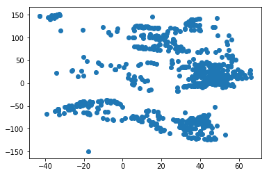

# DBEX6-KFS
> by Kristian Flejsborg Sørensen (cph-kf96)

## about LIMIT
given this assignment is to be read by people that have access to the same data, LIMIT will be used to reduce the length of this handin, if you wish to verify the full data from each query your free to call the same queries and related queries without the LIMIT.


```python
%load_ext sql
```


```python
%matplotlib inline
```


```python
%sql postgresql://appdev@data:5432/appdev
```


    'Connected: appdev@appdev'


```python
%sql SELECT * FROM geonames limit 10
```

    10 rows affected.


<table>
    <tr>
        <th>geonameid</th>
        <th>name</th>
        <th>longitude</th>
        <th>latitude</th>
        <th>feature_class</th>
        <th>feature_code</th>
        <th>country_code</th>
        <th>admin1_code</th>
        <th>admin2_code</th>
        <th>population</th>
        <th>elevation</th>
        <th>timezone</th>
    </tr>
    <tr>
        <td>3038871</td>
        <td>Obac de la Vall</td>
        <td>1.50498</td>
        <td>42.46602</td>
        <td>T</td>
        <td>SLP</td>
        <td>AD</td>
        <td>06</td>
        <td>None</td>
        <td>0</td>
        <td>None</td>
        <td>Europe/Andorra</td>
    </tr>
    <tr>
        <td>3038956</td>
        <td>Canal del Teixó</td>
        <td>1.50498</td>
        <td>42.55646</td>
        <td>H</td>
        <td>STM</td>
        <td>AD</td>
        <td>04</td>
        <td>None</td>
        <td>0</td>
        <td>None</td>
        <td>Europe/Andorra</td>
    </tr>
    <tr>
        <td>3038989</td>
        <td>Solana del Soriguer</td>
        <td>1.55225</td>
        <td>42.56963</td>
        <td>T</td>
        <td>SLP</td>
        <td>AD</td>
        <td>05</td>
        <td>None</td>
        <td>0</td>
        <td>None</td>
        <td>Europe/Andorra</td>
    </tr>
    <tr>
        <td>3039152</td>
        <td>Bosc de Sant Romà</td>
        <td>1.49933</td>
        <td>42.45309</td>
        <td>V</td>
        <td>FRST</td>
        <td>AD</td>
        <td>06</td>
        <td>None</td>
        <td>0</td>
        <td>None</td>
        <td>Europe/Andorra</td>
    </tr>
    <tr>
        <td>3039170</td>
        <td>Sant Esteve</td>
        <td>1.49421</td>
        <td>42.44038</td>
        <td>S</td>
        <td>CH</td>
        <td>AD</td>
        <td>06</td>
        <td>None</td>
        <td>0</td>
        <td>None</td>
        <td>Europe/Andorra</td>
    </tr>
    <tr>
        <td>3039210</td>
        <td>Canal de Rudielles</td>
        <td>1.45191</td>
        <td>42.48862</td>
        <td>H</td>
        <td>STM</td>
        <td>AD</td>
        <td>00</td>
        <td>None</td>
        <td>0</td>
        <td>None</td>
        <td>Europe/Andorra</td>
    </tr>
    <tr>
        <td>3039242</td>
        <td>Estany Rodó</td>
        <td>1.65469</td>
        <td>42.49518</td>
        <td>H</td>
        <td>LK</td>
        <td>AD</td>
        <td>03</td>
        <td>None</td>
        <td>0</td>
        <td>None</td>
        <td>Europe/Andorra</td>
    </tr>
    <tr>
        <td>3039281</td>
        <td>Torrent de Ribassols</td>
        <td>1.48074</td>
        <td>42.57626</td>
        <td>H</td>
        <td>STM</td>
        <td>AD</td>
        <td>04</td>
        <td>None</td>
        <td>0</td>
        <td>None</td>
        <td>Europe/Andorra</td>
    </tr>
    <tr>
        <td>3039497</td>
        <td>Serra Plana</td>
        <td>1.60201</td>
        <td>42.58241</td>
        <td>T</td>
        <td>SPUR</td>
        <td>AD</td>
        <td>02</td>
        <td>None</td>
        <td>0</td>
        <td>None</td>
        <td>Europe/Andorra</td>
    </tr>
    <tr>
        <td>3039501</td>
        <td>Coll de la Plana</td>
        <td>1.51319</td>
        <td>42.45737</td>
        <td>T</td>
        <td>PASS</td>
        <td>AD</td>
        <td>06</td>
        <td>None</td>
        <td>0</td>
        <td>None</td>
        <td>Europe/Andorra</td>
    </tr>
</table>


## In the first part you'll be processing the data in the geonames table.
### 1 - A. Find the tuple with the largest population
the following query achives this.


```python
%sql SELECT * FROM geonames WHERE population IN (SELECT MAX(population) FROM geonames)
```

    1 rows affected.


<table>
    <tr>
        <th>geonameid</th>
        <th>name</th>
        <th>longitude</th>
        <th>latitude</th>
        <th>feature_class</th>
        <th>feature_code</th>
        <th>country_code</th>
        <th>admin1_code</th>
        <th>admin2_code</th>
        <th>population</th>
        <th>elevation</th>
        <th>timezone</th>
    </tr>
    <tr>
        <td>305104</td>
        <td>Levant</td>
        <td>36.0</td>
        <td>34.0</td>
        <td>L</td>
        <td>RGN</td>
        <td>None</td>
        <td>None</td>
        <td>None</td>
        <td>44990000</td>
        <td>None</td>
        <td>Asia/Beirut</td>
    </tr>
</table>


### 1 - B. Now calculate the distance from all locations to the tuple above using the <-> function
first a view is created for easier use of above query, then that query is compared to all in geonames, note this does compare itself aswell but as the point says "all locations" this is a none issue.


```python
%%sql 
CREATE VIEW maxpup as
SELECT * FROM geonames WHERE population IN (SELECT MAX(population) FROM geonames)
```

    (psycopg2.ProgrammingError) relation "maxpup" already exists
     [SQL: 'CREATE VIEW maxpup as\nSELECT * FROM geonames WHERE population IN (SELECT MAX(population) FROM geonames)']


```python
%%sql 
SELECT (SELECT point(maxpup.longitude, maxpup.latitude) FROM maxpup) 
<-> point(geonames.longitude, geonames.latitude) as Distance, name FROM geonames LIMIT 10
```

    10 rows affected.


<table>
    <tr>
        <th>distance</th>
        <th>name</th>
    </tr>
    <tr>
        <td>35.5187260391022</td>
        <td>Obac de la Vall</td>
    </tr>
    <tr>
        <td>35.5403912827645</td>
        <td>Canal del Teixó</td>
    </tr>
    <tr>
        <td>35.4976906065648</td>
        <td>Solana del Soriguer</td>
    </tr>
    <tr>
        <td>35.5211340049413</td>
        <td>Bosc de Sant Romà</td>
    </tr>
    <tr>
        <td>35.5230848613757</td>
        <td>Sant Esteve</td>
    </tr>
    <tr>
        <td>35.5756544866359</td>
        <td>Canal de Rudielles</td>
    </tr>
    <tr>
        <td>35.3803392045427</td>
        <td>Estany Rodó</td>
    </tr>
    <tr>
        <td>35.5686877257961</td>
        <td>Torrent de Ribassols</td>
    </tr>
    <tr>
        <td>35.4524960679527</td>
        <td>Serra Plana</td>
    </tr>
    <tr>
        <td>35.5086914894509</td>
        <td>Coll de la Plana</td>
    </tr>
</table>


```python
%%sql
-- Haversine Formula based geodistance in miles (constant is diameter of Earth in miles)
-- Based on a similar PostgreSQL function found here: https://gist.github.com/831833
-- Updated to use distance formulas found here: http://www.codecodex.com/wiki/Calculate_distance_between_two_points_on_a_globe
CREATE OR REPLACE FUNCTION public.geodistance(alat double precision, alng double precision, blat double precision, blng double precision)
  RETURNS double precision AS
$BODY$
SELECT asin(
  sqrt(
    sin(radians($3-$1)/2)^2 +
    sin(radians($4-$2)/2)^2 *
    cos(radians($1)) *
    cos(radians($3))
  )
) * 7926.3352 AS distance;
$BODY$
  LANGUAGE sql IMMUTABLE
  COST 100;
```

    Done.


    []


### 1 - C. Now calculate the distance from all locations to the tuple above using the haversine distance
in this example maxpup was not used as it gave to much trouble to make a join in this scenario.


```python
%%sql SELECT name, longitude, latitude, geodistance(latitude, longitude, 36, 34) as distance 
FROM geonames order by distance LIMIT 10;
```

    10 rows affected.


<table>
    <tr>
        <th>name</th>
        <th>longitude</th>
        <th>latitude</th>
        <th>distance</th>
    </tr>
    <tr>
        <td>Mazi İni</td>
        <td>33.88903</td>
        <td>36.46384</td>
        <td>32.6759175438214</td>
    </tr>
    <tr>
        <td>Ágios Geórgios Sakkás</td>
        <td>34.24257</td>
        <td>35.55606</td>
        <td>33.5893073137377</td>
    </tr>
    <tr>
        <td>Melánarga</td>
        <td>34.19685</td>
        <td>35.5147</td>
        <td>35.3401264674149</td>
    </tr>
    <tr>
        <td>Mazoulia</td>
        <td>34.1086</td>
        <td>35.48976</td>
        <td>35.8161933804295</td>
    </tr>
    <tr>
        <td>Platanissós</td>
        <td>34.10682</td>
        <td>35.47866</td>
        <td>36.5565544091764</td>
    </tr>
    <tr>
        <td>Trapezoulli</td>
        <td>34.00833</td>
        <td>35.44583</td>
        <td>38.3349721980457</td>
    </tr>
    <tr>
        <td>Yaroluğu Çeşmesi</td>
        <td>33.54263</td>
        <td>36.41497</td>
        <td>38.4123849136707</td>
    </tr>
    <tr>
        <td>Varkes</td>
        <td>34.00417</td>
        <td>35.40833</td>
        <td>40.9266754946173</td>
    </tr>
    <tr>
        <td>Çiriş</td>
        <td>34.21298</td>
        <td>36.62601</td>
        <td>44.8989717512176</td>
    </tr>
    <tr>
        <td>Phourni Rock</td>
        <td>33.7</td>
        <td>35.38333</td>
        <td>45.8639388236397</td>
    </tr>
</table>


A view is created for the 1.D part in the assignment


```python
%sql Create view top1000 as Select * from geonames order by population desc limit 1000
```

    Done.


    []


```python
%sql select * from top1000 LIMIT 10
```

    10 rows affected.


<table>
    <tr>
        <th>geonameid</th>
        <th>name</th>
        <th>longitude</th>
        <th>latitude</th>
        <th>feature_class</th>
        <th>feature_code</th>
        <th>country_code</th>
        <th>admin1_code</th>
        <th>admin2_code</th>
        <th>population</th>
        <th>elevation</th>
        <th>timezone</th>
    </tr>
    <tr>
        <td>305104</td>
        <td>Levant</td>
        <td>36.0</td>
        <td>34.0</td>
        <td>L</td>
        <td>RGN</td>
        <td>None</td>
        <td>None</td>
        <td>None</td>
        <td>44990000</td>
        <td>None</td>
        <td>Asia/Beirut</td>
    </tr>
    <tr>
        <td>1227603</td>
        <td>Democratic Socialist Republic of Sri Lanka</td>
        <td>80.75</td>
        <td>7.75</td>
        <td>A</td>
        <td>PCLI</td>
        <td>LK</td>
        <td>00</td>
        <td>None</td>
        <td>21513990</td>
        <td>None</td>
        <td>Asia/Colombo</td>
    </tr>
    <tr>
        <td>3451189</td>
        <td>Rio de Janeiro</td>
        <td>-42.5</td>
        <td>-22.25</td>
        <td>A</td>
        <td>ADM1</td>
        <td>BR</td>
        <td>21</td>
        <td>None</td>
        <td>15993583</td>
        <td>None</td>
        <td>America/Sao_Paulo</td>
    </tr>
    <tr>
        <td>7671048</td>
        <td>Rangpur Division</td>
        <td>89.0</td>
        <td>25.83333</td>
        <td>A</td>
        <td>ADM1</td>
        <td>BD</td>
        <td>87</td>
        <td>None</td>
        <td>15787758</td>
        <td>None</td>
        <td>Asia/Dhaka</td>
    </tr>
    <tr>
        <td>1522867</td>
        <td>Republic of Kazakhstan</td>
        <td>68.0</td>
        <td>48.0</td>
        <td>A</td>
        <td>PCLI</td>
        <td>KZ</td>
        <td>00</td>
        <td>None</td>
        <td>15340000</td>
        <td>None</td>
        <td>None</td>
    </tr>
    <tr>
        <td>4896861</td>
        <td>Illinois</td>
        <td>-89.25037</td>
        <td>40.00032</td>
        <td>A</td>
        <td>ADM1</td>
        <td>US</td>
        <td>IL</td>
        <td>None</td>
        <td>12772888</td>
        <td>191</td>
        <td>America/Chicago</td>
    </tr>
    <tr>
        <td>2245662</td>
        <td>Republic of Senegal</td>
        <td>-14.25</td>
        <td>14.5</td>
        <td>A</td>
        <td>PCLI</td>
        <td>SN</td>
        <td>00</td>
        <td>None</td>
        <td>12323252</td>
        <td>None</td>
        <td>Africa/Dakar</td>
    </tr>
    <tr>
        <td>3530597</td>
        <td>Mexico City</td>
        <td>-99.12766</td>
        <td>19.42847</td>
        <td>P</td>
        <td>PPLC</td>
        <td>MX</td>
        <td>09</td>
        <td>015</td>
        <td>12294193</td>
        <td>None</td>
        <td>America/Mexico_City</td>
    </tr>
    <tr>
        <td>1254662</td>
        <td>Thane</td>
        <td>73.25</td>
        <td>19.33333</td>
        <td>A</td>
        <td>ADM2</td>
        <td>IN</td>
        <td>16</td>
        <td>517</td>
        <td>11060148</td>
        <td>None</td>
        <td>Asia/Kolkata</td>
    </tr>
    <tr>
        <td>501165</td>
        <td>Rostovskaya Oblast’</td>
        <td>41.08083</td>
        <td>47.44032</td>
        <td>A</td>
        <td>ADM1</td>
        <td>RU</td>
        <td>61</td>
        <td>None</td>
        <td>4397303</td>
        <td>None</td>
        <td>Europe/Moscow</td>
    </tr>
</table>


```python
result = %sql SELECT latitude, longitude FROM top1000
```

    1000 rows affected.


### 1 - D. Plot the latitude and longitude of the largest 1000 populations on a 2-D scatter plot
after the above preperation using the following query we split the data in two list of longitude and latitude and then use the scatter function from the import to plot the values of the top 1000 populations.


```python
import matplotlib.pyplot as plt
list1, list2 = zip(*result)
plt.scatter(list1, list2)
plt.show()
```





## In the second part your job is to work with JSON data from the magic schema. The schema is based on the game Magic: 
### 2 - A. Find all the cards that is made by Rob Alexander
The following query finds all cards that contains Rob Alexanders name.


```python
%sql SELECT data FROM cards WHERE data @> '{"artist":"Rob Alexander"}' LIMIT 10;
```

    10 rows affected.


<table>
    <tr>
        <th>data</th>
    </tr>
    <tr>
        <td>{&#x27;id&#x27;: &#x27;4a7bf234af44e07d9a159d4d89e96ce320919917&#x27;, &#x27;cmc&#x27;: 6, &#x27;name&#x27;: &#x27;Beacon of Immortality&#x27;, &#x27;text&#x27;: &quot;Double target player&#x27;s life total. Shuffle Beacon of Immortality into its owner&#x27;s library.&quot;, &#x27;type&#x27;: &#x27;Instant&#x27;, &#x27;types&#x27;: [&#x27;Instant&#x27;], &#x27;artist&#x27;: &#x27;Rob Alexander&#x27;, &#x27;colors&#x27;: [&#x27;White&#x27;], &#x27;flavor&#x27;: &#x27;The cave floods with light. A thousand rays shine forth and meld into one.&#x27;, &#x27;layout&#x27;: &#x27;normal&#x27;, &#x27;number&#x27;: &#x27;10&#x27;, &#x27;rarity&#x27;: &#x27;Rare&#x27;, &#x27;manaCost&#x27;: &#x27;{5}{W}&#x27;, &#x27;imageName&#x27;: &#x27;beacon of immortality&#x27;, &#x27;mciNumber&#x27;: &#x27;10&#x27;, &#x27;multiverseid&#x27;: 130553, &#x27;colorIdentity&#x27;: [&#x27;W&#x27;]}</td>
    </tr>
    <tr>
        <td>{&#x27;id&#x27;: &#x27;9cea331c080c3bbc7987c6560f65e39e9d1ed34f&#x27;, &#x27;cmc&#x27;: 5, &#x27;name&#x27;: &#x27;Kavu Climber&#x27;, &#x27;text&#x27;: &#x27;When Kavu Climber enters the battlefield, draw a card.&#x27;, &#x27;type&#x27;: &#x27;Creature — Kavu&#x27;, &#x27;power&#x27;: &#x27;3&#x27;, &#x27;types&#x27;: [&#x27;Creature&#x27;], &#x27;artist&#x27;: &#x27;Rob Alexander&#x27;, &#x27;colors&#x27;: [&#x27;Green&#x27;], &#x27;flavor&#x27;: &#x27;&quot;There was a crack of branches, a rustle of leaves, then a tremendous roar. Our party had no chance as death descended from above.&quot;\n—Taseen, elvish bard&#x27;, &#x27;layout&#x27;: &#x27;normal&#x27;, &#x27;number&#x27;: &#x27;273&#x27;, &#x27;rarity&#x27;: &#x27;Common&#x27;, &#x27;manaCost&#x27;: &#x27;{3}{G}{G}&#x27;, &#x27;subtypes&#x27;: [&#x27;Kavu&#x27;], &#x27;imageName&#x27;: &#x27;kavu climber&#x27;, &#x27;mciNumber&#x27;: &#x27;273&#x27;, &#x27;toughness&#x27;: &#x27;3&#x27;, &#x27;multiverseid&#x27;: 129511, &#x27;colorIdentity&#x27;: [&#x27;G&#x27;]}</td>
    </tr>
    <tr>
        <td>{&#x27;id&#x27;: &#x27;28cc7c79cca8939fd9661f7abfc6ca453715b75e&#x27;, &#x27;cmc&#x27;: 0, &#x27;name&#x27;: &#x27;Llanowar Wastes&#x27;, &#x27;text&#x27;: &#x27;{T}: Add {C} to your mana pool.\n{T}: Add {B} or {G} to your mana pool. Llanowar Wastes deals 1 damage to you.&#x27;, &#x27;type&#x27;: &#x27;Land&#x27;, &#x27;types&#x27;: [&#x27;Land&#x27;], &#x27;artist&#x27;: &#x27;Rob Alexander&#x27;, &#x27;layout&#x27;: &#x27;normal&#x27;, &#x27;number&#x27;: &#x27;355&#x27;, &#x27;rarity&#x27;: &#x27;Rare&#x27;, &#x27;imageName&#x27;: &#x27;llanowar wastes&#x27;, &#x27;mciNumber&#x27;: &#x27;355&#x27;, &#x27;multiverseid&#x27;: 129627, &#x27;colorIdentity&#x27;: [&#x27;B&#x27;, &#x27;G&#x27;]}</td>
    </tr>
    <tr>
        <td>{&#x27;id&#x27;: &#x27;7a90b7ba6197f8774ed99ecf75ac9abb3e0c0f20&#x27;, &#x27;cmc&#x27;: 0, &#x27;name&#x27;: &#x27;Shivan Reef&#x27;, &#x27;text&#x27;: &#x27;{T}: Add {C} to your mana pool.\n{T}: Add {U} or {R} to your mana pool. Shivan Reef deals 1 damage to you.&#x27;, &#x27;type&#x27;: &#x27;Land&#x27;, &#x27;types&#x27;: [&#x27;Land&#x27;], &#x27;artist&#x27;: &#x27;Rob Alexander&#x27;, &#x27;layout&#x27;: &#x27;normal&#x27;, &#x27;number&#x27;: &#x27;357&#x27;, &#x27;rarity&#x27;: &#x27;Rare&#x27;, &#x27;imageName&#x27;: &#x27;shivan reef&#x27;, &#x27;mciNumber&#x27;: &#x27;357&#x27;, &#x27;multiverseid&#x27;: 129731, &#x27;colorIdentity&#x27;: [&#x27;U&#x27;, &#x27;R&#x27;]}</td>
    </tr>
    <tr>
        <td>{&#x27;id&#x27;: &#x27;8d1035f151615c949d0645b70fe01d8ab4a3f796&#x27;, &#x27;cmc&#x27;: 0, &#x27;name&#x27;: &#x27;Sulfurous Springs&#x27;, &#x27;text&#x27;: &#x27;{T}: Add {C} to your mana pool.\n{T}: Add {B} or {R} to your mana pool. Sulfurous Springs deals 1 damage to you.&#x27;, &#x27;type&#x27;: &#x27;Land&#x27;, &#x27;types&#x27;: [&#x27;Land&#x27;], &#x27;artist&#x27;: &#x27;Rob Alexander&#x27;, &#x27;layout&#x27;: &#x27;normal&#x27;, &#x27;number&#x27;: &#x27;359&#x27;, &#x27;rarity&#x27;: &#x27;Rare&#x27;, &#x27;imageName&#x27;: &#x27;sulfurous springs&#x27;, &#x27;mciNumber&#x27;: &#x27;359&#x27;, &#x27;multiverseid&#x27;: 129751, &#x27;colorIdentity&#x27;: [&#x27;B&#x27;, &#x27;R&#x27;]}</td>
    </tr>
    <tr>
        <td>{&#x27;id&#x27;: &#x27;c97103ab834aad9b3fb7d07c4fb563089f97fe87&#x27;, &#x27;cmc&#x27;: 0, &#x27;name&#x27;: &#x27;Treetop Village&#x27;, &#x27;text&#x27;: &quot;Treetop Village enters the battlefield tapped.\n{T}: Add {G} to your mana pool.\n{1}{G}: Treetop Village becomes a 3/3 green Ape creature with trample until end of turn. It&#x27;s still a land. (If it would assign enough damage to its blockers to destroy them, you may have it assign the rest of its damage to defending player or planeswalker.)&quot;, &#x27;type&#x27;: &#x27;Land&#x27;, &#x27;types&#x27;: [&#x27;Land&#x27;], &#x27;artist&#x27;: &#x27;Rob Alexander&#x27;, &#x27;layout&#x27;: &#x27;normal&#x27;, &#x27;number&#x27;: &#x27;361&#x27;, &#x27;rarity&#x27;: &#x27;Uncommon&#x27;, &#x27;imageName&#x27;: &#x27;treetop village&#x27;, &#x27;mciNumber&#x27;: &#x27;361&#x27;, &#x27;multiverseid&#x27;: 106455, &#x27;colorIdentity&#x27;: [&#x27;G&#x27;]}</td>
    </tr>
    <tr>
        <td>{&#x27;id&#x27;: &#x27;24a47bf9cb4596246501294e7127bf74e082bc1d&#x27;, &#x27;cmc&#x27;: 0, &#x27;name&#x27;: &#x27;Plains&#x27;, &#x27;type&#x27;: &#x27;Basic Land — Plains&#x27;, &#x27;types&#x27;: [&#x27;Land&#x27;], &#x27;artist&#x27;: &#x27;Rob Alexander&#x27;, &#x27;layout&#x27;: &#x27;normal&#x27;, &#x27;number&#x27;: &#x27;364&#x27;, &#x27;rarity&#x27;: &#x27;Basic Land&#x27;, &#x27;subtypes&#x27;: [&#x27;Plains&#x27;], &#x27;imageName&#x27;: &#x27;plains1&#x27;, &#x27;watermark&#x27;: &#x27;White&#x27;, &#x27;supertypes&#x27;: [&#x27;Basic&#x27;], &#x27;variations&#x27;: [129682, 129683, 129681], &#x27;multiverseid&#x27;: 129680, &#x27;colorIdentity&#x27;: [&#x27;W&#x27;]}</td>
    </tr>
    <tr>
        <td>{&#x27;id&#x27;: &#x27;be5e30798e4f8b9b6f6e6a8dd2e30bf86bb04b94&#x27;, &#x27;cmc&#x27;: 0, &#x27;name&#x27;: &#x27;Forest&#x27;, &#x27;type&#x27;: &#x27;Basic Land — Forest&#x27;, &#x27;types&#x27;: [&#x27;Land&#x27;], &#x27;artist&#x27;: &#x27;Rob Alexander&#x27;, &#x27;layout&#x27;: &#x27;normal&#x27;, &#x27;number&#x27;: &#x27;382&#x27;, &#x27;rarity&#x27;: &#x27;Basic Land&#x27;, &#x27;subtypes&#x27;: [&#x27;Forest&#x27;], &#x27;imageName&#x27;: &#x27;forest3&#x27;, &#x27;watermark&#x27;: &#x27;Green&#x27;, &#x27;supertypes&#x27;: [&#x27;Basic&#x27;], &#x27;variations&#x27;: [129559, 129562, 129560], &#x27;multiverseid&#x27;: 129561, &#x27;colorIdentity&#x27;: [&#x27;G&#x27;]}</td>
    </tr>
    <tr>
        <td>{&#x27;id&#x27;: &#x27;4c3d9f2b7086021880c8268f9def8f7548116d17&#x27;, &#x27;cmc&#x27;: 0, &#x27;name&#x27;: &#x27;Badlands&#x27;, &#x27;text&#x27;: &#x27;({T}: Add {B} or {R} to your mana pool.)&#x27;, &#x27;type&#x27;: &#x27;Land — Swamp Mountain&#x27;, &#x27;types&#x27;: [&#x27;Land&#x27;], &#x27;artist&#x27;: &#x27;Rob Alexander&#x27;, &#x27;layout&#x27;: &#x27;normal&#x27;, &#x27;rarity&#x27;: &#x27;Rare&#x27;, &#x27;reserved&#x27;: True, &#x27;subtypes&#x27;: [&#x27;Swamp&#x27;, &#x27;Mountain&#x27;], &#x27;imageName&#x27;: &#x27;badlands&#x27;, &#x27;mciNumber&#x27;: &#x27;278&#x27;, &#x27;multiverseid&#x27;: 878, &#x27;colorIdentity&#x27;: [&#x27;B&#x27;, &#x27;R&#x27;]}</td>
    </tr>
    <tr>
        <td>{&#x27;id&#x27;: &#x27;3ad1eecb97909f6d45763cc87c07fa23cf574cf7&#x27;, &#x27;cmc&#x27;: 1, &#x27;name&#x27;: &#x27;Lance&#x27;, &#x27;text&#x27;: &#x27;Enchant creature\nEnchanted creature has first strike.&#x27;, &#x27;type&#x27;: &#x27;Enchantment — Aura&#x27;, &#x27;types&#x27;: [&#x27;Enchantment&#x27;], &#x27;artist&#x27;: &#x27;Rob Alexander&#x27;, &#x27;colors&#x27;: [&#x27;White&#x27;], &#x27;layout&#x27;: &#x27;normal&#x27;, &#x27;rarity&#x27;: &#x27;Uncommon&#x27;, &#x27;manaCost&#x27;: &#x27;{W}&#x27;, &#x27;subtypes&#x27;: [&#x27;Aura&#x27;], &#x27;imageName&#x27;: &#x27;lance&#x27;, &#x27;mciNumber&#x27;: &#x27;212&#x27;, &#x27;multiverseid&#x27;: 856, &#x27;colorIdentity&#x27;: [&#x27;W&#x27;]}</td>
    </tr>
</table>


### 2 - B. Find all the cards that have the subtype "Human"
the following query achives this.


```python
%sql SELECT data FROM cards WHERE data @> '{"subtypes":["Human"]}' LIMIT 10;
```

    10 rows affected.


<table>
    <tr>
        <th>data</th>
    </tr>
    <tr>
        <td>{&#x27;id&#x27;: &#x27;ab1ab474019e4e76c66e2b524d354cb7c3212616&#x27;, &#x27;cmc&#x27;: 7, &#x27;name&#x27;: &quot;Ancestor&#x27;s Chosen&quot;, &#x27;text&#x27;: &quot;First strike (This creature deals combat damage before creatures without first strike.)\nWhen Ancestor&#x27;s Chosen enters the battlefield, you gain 1 life for each card in your graveyard.&quot;, &#x27;type&#x27;: &#x27;Creature — Human Cleric&#x27;, &#x27;power&#x27;: &#x27;4&#x27;, &#x27;types&#x27;: [&#x27;Creature&#x27;], &#x27;artist&#x27;: &#x27;Pete Venters&#x27;, &#x27;colors&#x27;: [&#x27;White&#x27;], &#x27;flavor&#x27;: &#x27;&quot;The will of all, by my hand done.&quot;&#x27;, &#x27;layout&#x27;: &#x27;normal&#x27;, &#x27;number&#x27;: &#x27;1&#x27;, &#x27;rarity&#x27;: &#x27;Uncommon&#x27;, &#x27;manaCost&#x27;: &#x27;{5}{W}{W}&#x27;, &#x27;subtypes&#x27;: [&#x27;Human&#x27;, &#x27;Cleric&#x27;], &#x27;imageName&#x27;: &quot;ancestor&#x27;s chosen&quot;, &#x27;mciNumber&#x27;: &#x27;1&#x27;, &#x27;toughness&#x27;: &#x27;4&#x27;, &#x27;multiverseid&#x27;: 130550, &#x27;colorIdentity&#x27;: [&#x27;W&#x27;]}</td>
    </tr>
    <tr>
        <td>{&#x27;id&#x27;: &#x27;d3488c0a916bd922856473155a8b49ec23fc2217&#x27;, &#x27;cmc&#x27;: 4, &#x27;name&#x27;: &#x27;Ballista Squad&#x27;, &#x27;text&#x27;: &#x27;{X}{W}, {T}: Ballista Squad deals X damage to target attacking or blocking creature.&#x27;, &#x27;type&#x27;: &#x27;Creature — Human Rebel&#x27;, &#x27;power&#x27;: &#x27;2&#x27;, &#x27;types&#x27;: [&#x27;Creature&#x27;], &#x27;artist&#x27;: &#x27;Matthew D. Wilson&#x27;, &#x27;colors&#x27;: [&#x27;White&#x27;], &#x27;flavor&#x27;: &#x27;The perfect antidote for a tightly packed formation.&#x27;, &#x27;layout&#x27;: &#x27;normal&#x27;, &#x27;number&#x27;: &#x27;8&#x27;, &#x27;rarity&#x27;: &#x27;Uncommon&#x27;, &#x27;manaCost&#x27;: &#x27;{3}{W}&#x27;, &#x27;subtypes&#x27;: [&#x27;Human&#x27;, &#x27;Rebel&#x27;], &#x27;imageName&#x27;: &#x27;ballista squad&#x27;, &#x27;mciNumber&#x27;: &#x27;8&#x27;, &#x27;toughness&#x27;: &#x27;2&#x27;, &#x27;multiverseid&#x27;: 129477, &#x27;colorIdentity&#x27;: [&#x27;W&#x27;]}</td>
    </tr>
    <tr>
        <td>{&#x27;id&#x27;: &#x27;29c46fca29e5de01dba3bbf05393325bc9132735&#x27;, &#x27;cmc&#x27;: 3, &#x27;name&#x27;: &#x27;Benalish Knight&#x27;, &#x27;text&#x27;: &#x27;Flash (You may cast this spell any time you could cast an instant.)\nFirst strike (This creature deals combat damage before creatures without first strike.)&#x27;, &#x27;type&#x27;: &#x27;Creature — Human Knight&#x27;, &#x27;power&#x27;: &#x27;2&#x27;, &#x27;types&#x27;: [&#x27;Creature&#x27;], &#x27;artist&#x27;: &#x27;Zoltan Boros &amp; Gabor Szikszai&#x27;, &#x27;colors&#x27;: [&#x27;White&#x27;], &#x27;flavor&#x27;: &#x27;&quot;We called them \&#x27;armored lightning.\&#x27;&quot;\n—Gerrard of the Weatherlight&#x27;, &#x27;layout&#x27;: &#x27;normal&#x27;, &#x27;number&#x27;: &#x27;11&#x27;, &#x27;rarity&#x27;: &#x27;Common&#x27;, &#x27;manaCost&#x27;: &#x27;{2}{W}&#x27;, &#x27;subtypes&#x27;: [&#x27;Human&#x27;, &#x27;Knight&#x27;], &#x27;imageName&#x27;: &#x27;benalish knight&#x27;, &#x27;mciNumber&#x27;: &#x27;11&#x27;, &#x27;toughness&#x27;: &#x27;2&#x27;, &#x27;multiverseid&#x27;: 136279, &#x27;colorIdentity&#x27;: [&#x27;W&#x27;]}</td>
    </tr>
    <tr>
        <td>{&#x27;id&#x27;: &#x27;e8b8dea65daf4e9070cce5de62bdbea0bf36d47c&#x27;, &#x27;cmc&#x27;: 4, &#x27;name&#x27;: &#x27;Cho-Manno, Revolutionary&#x27;, &#x27;text&#x27;: &#x27;Prevent all damage that would be dealt to Cho-Manno, Revolutionary.&#x27;, &#x27;type&#x27;: &#x27;Legendary Creature — Human Rebel&#x27;, &#x27;power&#x27;: &#x27;2&#x27;, &#x27;types&#x27;: [&#x27;Creature&#x27;], &#x27;artist&#x27;: &#x27;Steven Belledin&#x27;, &#x27;colors&#x27;: [&#x27;White&#x27;], &#x27;flavor&#x27;: &#x27;&quot;Mercadia\&#x27;s masks can no longer hide the truth. Our day has come at last.&quot;&#x27;, &#x27;layout&#x27;: &#x27;normal&#x27;, &#x27;number&#x27;: &#x27;12&#x27;, &#x27;rarity&#x27;: &#x27;Rare&#x27;, &#x27;manaCost&#x27;: &#x27;{2}{W}{W}&#x27;, &#x27;subtypes&#x27;: [&#x27;Human&#x27;, &#x27;Rebel&#x27;], &#x27;imageName&#x27;: &#x27;cho-manno, revolutionary&#x27;, &#x27;mciNumber&#x27;: &#x27;12&#x27;, &#x27;toughness&#x27;: &#x27;2&#x27;, &#x27;supertypes&#x27;: [&#x27;Legendary&#x27;], &#x27;multiverseid&#x27;: 130554, &#x27;colorIdentity&#x27;: [&#x27;W&#x27;]}</td>
    </tr>
    <tr>
        <td>{&#x27;id&#x27;: &#x27;80a6b907fc380ed97615e8abc0fe6071c4ceef67&#x27;, &#x27;cmc&#x27;: 3, &#x27;name&#x27;: &#x27;Field Marshal&#x27;, &#x27;text&#x27;: &#x27;Other Soldier creatures get +1/+1 and have first strike. (They deal combat damage before creatures without first strike.)&#x27;, &#x27;type&#x27;: &#x27;Creature — Human Soldier&#x27;, &#x27;power&#x27;: &#x27;2&#x27;, &#x27;types&#x27;: [&#x27;Creature&#x27;], &#x27;artist&#x27;: &#x27;Stephen Tappin&#x27;, &#x27;colors&#x27;: [&#x27;White&#x27;], &#x27;flavor&#x27;: &#x27;He is the only one who sees the patterns in the overlapping maps and conflicting reports.&#x27;, &#x27;layout&#x27;: &#x27;normal&#x27;, &#x27;number&#x27;: &#x27;15&#x27;, &#x27;rarity&#x27;: &#x27;Rare&#x27;, &#x27;manaCost&#x27;: &#x27;{1}{W}{W}&#x27;, &#x27;subtypes&#x27;: [&#x27;Human&#x27;, &#x27;Soldier&#x27;], &#x27;imageName&#x27;: &#x27;field marshal&#x27;, &#x27;mciNumber&#x27;: &#x27;15&#x27;, &#x27;toughness&#x27;: &#x27;2&#x27;, &#x27;multiverseid&#x27;: 135258, &#x27;colorIdentity&#x27;: [&#x27;W&#x27;]}</td>
    </tr>
    <tr>
        <td>{&#x27;id&#x27;: &#x27;7879b835a2c3d6516515d03bd3a3894dceee1812&#x27;, &#x27;cmc&#x27;: 1, &#x27;name&#x27;: &#x27;Honor Guard&#x27;, &#x27;text&#x27;: &#x27;{W}: Honor Guard gets +0/+1 until end of turn.&#x27;, &#x27;type&#x27;: &#x27;Creature — Human Soldier&#x27;, &#x27;power&#x27;: &#x27;1&#x27;, &#x27;types&#x27;: [&#x27;Creature&#x27;], &#x27;artist&#x27;: &#x27;Dan Dos Santos&#x27;, &#x27;colors&#x27;: [&#x27;White&#x27;], &#x27;flavor&#x27;: &#x27;The strength of one. The courage of ten.&#x27;, &#x27;layout&#x27;: &#x27;normal&#x27;, &#x27;number&#x27;: &#x27;23&#x27;, &#x27;rarity&#x27;: &#x27;Common&#x27;, &#x27;manaCost&#x27;: &#x27;{W}&#x27;, &#x27;subtypes&#x27;: [&#x27;Human&#x27;, &#x27;Soldier&#x27;], &#x27;imageName&#x27;: &#x27;honor guard&#x27;, &#x27;mciNumber&#x27;: &#x27;23&#x27;, &#x27;toughness&#x27;: &#x27;1&#x27;, &#x27;multiverseid&#x27;: 129595, &#x27;colorIdentity&#x27;: [&#x27;W&#x27;]}</td>
    </tr>
    <tr>
        <td>{&#x27;id&#x27;: &#x27;55932565b6905650e67e784b7cf0df63990e9851&#x27;, &#x27;cmc&#x27;: 1, &#x27;name&#x27;: &#x27;Icatian Priest&#x27;, &#x27;text&#x27;: &#x27;{1}{W}{W}: Target creature gets +1/+1 until end of turn.&#x27;, &#x27;type&#x27;: &#x27;Creature — Human Cleric&#x27;, &#x27;power&#x27;: &#x27;1&#x27;, &#x27;types&#x27;: [&#x27;Creature&#x27;], &#x27;artist&#x27;: &#x27;Stephen Tappin&#x27;, &#x27;colors&#x27;: [&#x27;White&#x27;], &#x27;flavor&#x27;: &quot;Grelden knelt and felt the cool, dry hand of the priest on his brow. Hours later, when his wits returned, he was covered in his enemies&#x27; blood on the field of victory.&quot;, &#x27;layout&#x27;: &#x27;normal&#x27;, &#x27;number&#x27;: &#x27;24&#x27;, &#x27;rarity&#x27;: &#x27;Uncommon&#x27;, &#x27;manaCost&#x27;: &#x27;{W}&#x27;, &#x27;subtypes&#x27;: [&#x27;Human&#x27;, &#x27;Cleric&#x27;], &#x27;imageName&#x27;: &#x27;icatian priest&#x27;, &#x27;mciNumber&#x27;: &#x27;24&#x27;, &#x27;toughness&#x27;: &#x27;1&#x27;, &#x27;multiverseid&#x27;: 132123, &#x27;colorIdentity&#x27;: [&#x27;W&#x27;]}</td>
    </tr>
    <tr>
        <td>{&#x27;id&#x27;: &#x27;bc1e197c295bc12cc1b392a11b94782f1396b263&#x27;, &#x27;cmc&#x27;: 5, &#x27;name&#x27;: &#x27;Kjeldoran Royal Guard&#x27;, &#x27;text&#x27;: &#x27;{T}: All combat damage that would be dealt to you by unblocked creatures this turn is dealt to Kjeldoran Royal Guard instead.&#x27;, &#x27;type&#x27;: &#x27;Creature — Human Soldier&#x27;, &#x27;power&#x27;: &#x27;2&#x27;, &#x27;types&#x27;: [&#x27;Creature&#x27;], &#x27;artist&#x27;: &#x27;Carl Critchlow&#x27;, &#x27;colors&#x27;: [&#x27;White&#x27;], &#x27;flavor&#x27;: &quot;Upon the frozen tundra stand the Kjeldoran Royal Guard, pikes raised, with the king&#x27;s oath upon their lips.&quot;, &#x27;layout&#x27;: &#x27;normal&#x27;, &#x27;number&#x27;: &#x27;25&#x27;, &#x27;rarity&#x27;: &#x27;Rare&#x27;, &#x27;manaCost&#x27;: &#x27;{3}{W}{W}&#x27;, &#x27;subtypes&#x27;: [&#x27;Human&#x27;, &#x27;Soldier&#x27;], &#x27;imageName&#x27;: &#x27;kjeldoran royal guard&#x27;, &#x27;mciNumber&#x27;: &#x27;25&#x27;, &#x27;toughness&#x27;: &#x27;5&#x27;, &#x27;multiverseid&#x27;: 130551, &#x27;colorIdentity&#x27;: [&#x27;W&#x27;]}</td>
    </tr>
    <tr>
        <td>{&#x27;id&#x27;: &#x27;e25120395df829af067675f1582ae946543094e2&#x27;, &#x27;cmc&#x27;: 1, &#x27;name&#x27;: &#x27;Loyal Sentry&#x27;, &#x27;text&#x27;: &#x27;When Loyal Sentry blocks a creature, destroy that creature and Loyal Sentry.&#x27;, &#x27;type&#x27;: &#x27;Creature — Human Soldier&#x27;, &#x27;power&#x27;: &#x27;1&#x27;, &#x27;types&#x27;: [&#x27;Creature&#x27;], &#x27;artist&#x27;: &#x27;Michael Sutfin&#x27;, &#x27;colors&#x27;: [&#x27;White&#x27;], &#x27;flavor&#x27;: &#x27;&quot;My cause is simple: To stop you, at any cost, from ever seeing the inside of this keep.&quot;&#x27;, &#x27;layout&#x27;: &#x27;normal&#x27;, &#x27;number&#x27;: &#x27;27&#x27;, &#x27;rarity&#x27;: &#x27;Rare&#x27;, &#x27;manaCost&#x27;: &#x27;{W}&#x27;, &#x27;subtypes&#x27;: [&#x27;Human&#x27;, &#x27;Soldier&#x27;], &#x27;imageName&#x27;: &#x27;loyal sentry&#x27;, &#x27;mciNumber&#x27;: &#x27;27&#x27;, &#x27;toughness&#x27;: &#x27;1&#x27;, &#x27;multiverseid&#x27;: 129798, &#x27;colorIdentity&#x27;: [&#x27;W&#x27;]}</td>
    </tr>
    <tr>
        <td>{&#x27;id&#x27;: &#x27;f0bd8f9ffd23760499a421ca4cd2f211130542b8&#x27;, &#x27;cmc&#x27;: 3, &#x27;name&#x27;: &#x27;Nomad Mythmaker&#x27;, &#x27;text&#x27;: &#x27;{W}, {T}: Put target Aura card from a graveyard onto the battlefield under your control attached to a creature you control.&#x27;, &#x27;type&#x27;: &#x27;Creature — Human Nomad Cleric&#x27;, &#x27;power&#x27;: &#x27;2&#x27;, &#x27;types&#x27;: [&#x27;Creature&#x27;], &#x27;artist&#x27;: &#x27;Darrell Riche&#x27;, &#x27;colors&#x27;: [&#x27;White&#x27;], &#x27;flavor&#x27;: &#x27;On the wild steppes, history vanishes in the dust. Only the mythmakers remain to say what was, and is, and will be.&#x27;, &#x27;layout&#x27;: &#x27;normal&#x27;, &#x27;number&#x27;: &#x27;30&#x27;, &#x27;rarity&#x27;: &#x27;Rare&#x27;, &#x27;manaCost&#x27;: &#x27;{2}{W}&#x27;, &#x27;subtypes&#x27;: [&#x27;Human&#x27;, &#x27;Nomad&#x27;, &#x27;Cleric&#x27;], &#x27;imageName&#x27;: &#x27;nomad mythmaker&#x27;, &#x27;mciNumber&#x27;: &#x27;30&#x27;, &#x27;toughness&#x27;: &#x27;2&#x27;, &#x27;multiverseid&#x27;: 130547, &#x27;colorIdentity&#x27;: [&#x27;W&#x27;]}</td>
    </tr>
</table>


### 2 - C. Group all the cards based on the colour. Aggregate them by counting the number of cards per colour.
first a view is created for the following query that seperates the cards into each group by colors, note None is the type for "colorless" cards, which also means "Lands" which have specific "colors" in the form of colorIdentity, yet don't have a color for gameplay purposes, all "colorless" cards are included given as a magic fan I would count them as cards with the color "colorless" since cast spells that requires colorless mana can use any color of mana.


```python
%sql Create view Colors as Select data ->> 'colors' as colors from cards
```

    (psycopg2.ProgrammingError) relation "colors" already exists
     [SQL: "Create view Colors as Select data ->> 'colors' as colors from cards"]


```python
%sql select colors, count(*) from Colors as amount group by Colors order by count desc
```

    32 rows affected.


<table>
    <tr>
        <th>colors</th>
        <th>count</th>
    </tr>
    <tr>
        <td>None</td>
        <td>7391</td>
    </tr>
    <tr>
        <td>[&quot;Green&quot;]</td>
        <td>4977</td>
    </tr>
    <tr>
        <td>[&quot;Black&quot;]</td>
        <td>4877</td>
    </tr>
    <tr>
        <td>[&quot;Red&quot;]</td>
        <td>4858</td>
    </tr>
    <tr>
        <td>[&quot;White&quot;]</td>
        <td>4755</td>
    </tr>
    <tr>
        <td>[&quot;Blue&quot;]</td>
        <td>4680</td>
    </tr>
    <tr>
        <td>[&quot;White&quot;, &quot;Green&quot;]</td>
        <td>276</td>
    </tr>
    <tr>
        <td>[&quot;Red&quot;, &quot;Green&quot;]</td>
        <td>273</td>
    </tr>
    <tr>
        <td>[&quot;Blue&quot;, &quot;Black&quot;]</td>
        <td>260</td>
    </tr>
    <tr>
        <td>[&quot;Black&quot;, &quot;Red&quot;]</td>
        <td>258</td>
    </tr>
    <tr>
        <td>[&quot;White&quot;, &quot;Blue&quot;]</td>
        <td>245</td>
    </tr>
    <tr>
        <td>[&quot;Black&quot;, &quot;Green&quot;]</td>
        <td>185</td>
    </tr>
    <tr>
        <td>[&quot;Blue&quot;, &quot;Red&quot;]</td>
        <td>182</td>
    </tr>
    <tr>
        <td>[&quot;White&quot;, &quot;Red&quot;]</td>
        <td>178</td>
    </tr>
    <tr>
        <td>[&quot;White&quot;, &quot;Black&quot;]</td>
        <td>174</td>
    </tr>
    <tr>
        <td>[&quot;Blue&quot;, &quot;Green&quot;]</td>
        <td>169</td>
    </tr>
    <tr>
        <td>[&quot;Blue&quot;, &quot;Black&quot;, &quot;Red&quot;]</td>
        <td>73</td>
    </tr>
    <tr>
        <td>[&quot;White&quot;, &quot;Blue&quot;, &quot;Black&quot;]</td>
        <td>57</td>
    </tr>
    <tr>
        <td>[&quot;White&quot;, &quot;Red&quot;, &quot;Green&quot;]</td>
        <td>54</td>
    </tr>
    <tr>
        <td>[&quot;White&quot;, &quot;Blue&quot;, &quot;Green&quot;]</td>
        <td>53</td>
    </tr>
    <tr>
        <td>[&quot;Black&quot;, &quot;Red&quot;, &quot;Green&quot;]</td>
        <td>52</td>
    </tr>
    <tr>
        <td>[&quot;White&quot;, &quot;Blue&quot;, &quot;Black&quot;, &quot;Red&quot;, &quot;Green&quot;]</td>
        <td>37</td>
    </tr>
    <tr>
        <td>[&quot;White&quot;, &quot;Black&quot;, &quot;Red&quot;]</td>
        <td>33</td>
    </tr>
    <tr>
        <td>[&quot;White&quot;, &quot;Black&quot;, &quot;Green&quot;]</td>
        <td>28</td>
    </tr>
    <tr>
        <td>[&quot;Blue&quot;, &quot;Red&quot;, &quot;Green&quot;]</td>
        <td>25</td>
    </tr>
    <tr>
        <td>[&quot;Blue&quot;, &quot;Black&quot;, &quot;Green&quot;]</td>
        <td>24</td>
    </tr>
    <tr>
        <td>[&quot;White&quot;, &quot;Blue&quot;, &quot;Red&quot;]</td>
        <td>22</td>
    </tr>
    <tr>
        <td>[&quot;Blue&quot;, &quot;Black&quot;, &quot;Red&quot;, &quot;Green&quot;]</td>
        <td>3</td>
    </tr>
    <tr>
        <td>[&quot;White&quot;, &quot;Black&quot;, &quot;Red&quot;, &quot;Green&quot;]</td>
        <td>2</td>
    </tr>
    <tr>
        <td>[&quot;White&quot;, &quot;Blue&quot;, &quot;Black&quot;, &quot;Green&quot;]</td>
        <td>2</td>
    </tr>
    <tr>
        <td>[&quot;White&quot;, &quot;Blue&quot;, &quot;Red&quot;, &quot;Green&quot;]</td>
        <td>2</td>
    </tr>
    <tr>
        <td>[&quot;White&quot;, &quot;Blue&quot;, &quot;Black&quot;, &quot;Red&quot;]</td>
        <td>2</td>
    </tr>
</table>


```python
%sql select count(*) from Colors as amount
```

    1 rows affected.


<table>
    <tr>
        <th>count</th>
    </tr>
    <tr>
        <td>34207</td>
    </tr>
</table>


